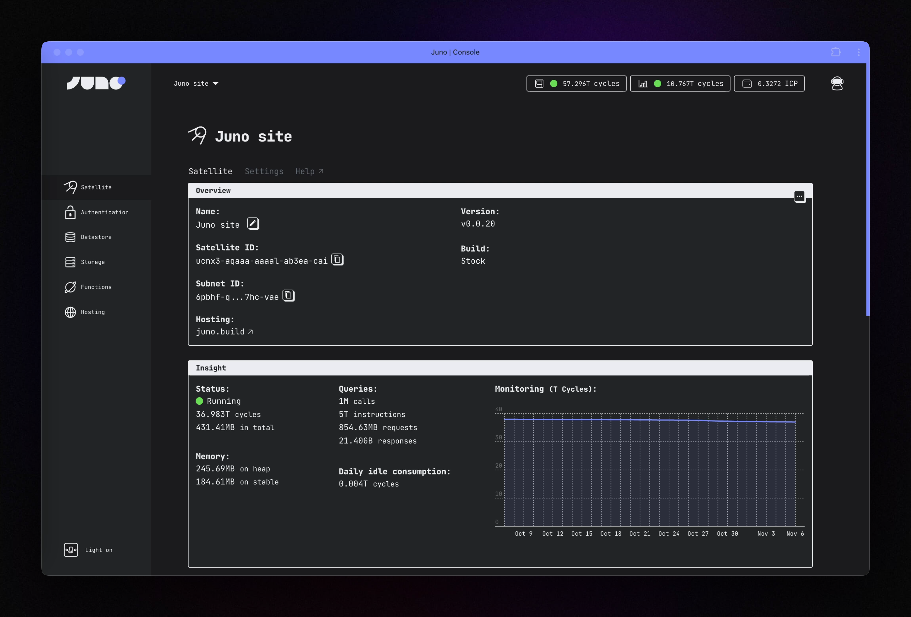

<div align="center" style="display:flex;flex-direction:column;">
  <a href="https://juno.build/">
    
  </a>

  <br />
  <br />

[](https://github.com/junobuild/juno/releases/latest)
[](https://github.com/junobuild/juno/actions/workflows/checks.yml)
[](https://github.com/junobuild/juno/actions/workflows/tests.yml)

</div>

[Juno] is a blockchainless (or zero-knowledge) development platform for creating innovative applications.

- 🔑 Authentication [[Docs](https://juno.build/docs/build/authentication)]
- 📦 Datastore [[Docs](https://juno.build/docs/build/datastore)]
- 📂 File Storage [[Docs](https://juno.build/docs/build/storage)]
- 🌐 Hosting [[Docs](https://juno.build/docs/build/hosting)]
- ⚙️ Functions [[Docs](https://juno.build/docs/build/functions)]
- 📊 Analytics [[Docs](https://juno.build/docs/build/analytics)]
- 👀 Monitoring [[Docs](https://juno.build/docs/management/monitoring)]
- 💾 Backups [[Docs](https://juno.build/docs/management/backups)]

<br />



<br />

## 🚀 Introduction

Juno is a blockchain-as-a-service (“blockchainless”) platform that empowers developers to build decentralized apps efficiently. Similar to Web2 cloud service platforms but with significant improvements, it offers a comprehensive toolkit to scaffold secure and efficient projects running on the blockchain.

With Juno, developers can integrate features such as authentication, data and file storage, hosting, serverless functions, or on-chain analytics provided by smart contracts. This allows them to scaffold projects using familiar patterns while maintaining complete control over their work.

In short, Juno is the Google Firebase alternative for Web3 ⚡️🤯.

## 💁‍♂️️ Links & Resources

Here are some useful links:

- Looking to get started? Check out the [Guides & Examples](https://juno.build/docs/category/guides-and-examples) for step-by-step tutorials and sample code.
- Explore the full [documentation](https://juno.build) for in-depth details on using and configuring Juno.
- See the [HACKING](HACKING.md) document for instructions on running and developing Juno locally.
- Have a look at the [LICENSE](LICENSE.md) for information about licensing and limitation.

## 🖥️ Bootstrap

Planning to build a decentralized website, blog, or application? Quickly scaffold your project with ready-made templates.

```bash
# with npm
npm create juno@latest
# with pnpm
yarn create juno
# with yarn
pnpm create juno
```

## 🐳 Docker

When building your project locally or contributing to this repo, ensure you have Docker installed on your machine ([Windows](https://docs.docker.com/desktop/install/windows-install/), [MacOS](https://docs.docker.com/desktop/install/mac-install/), or [Linux](https://docs.docker.com/desktop/install/linux-install/)).

> [!NOTE]
> For MacBooks with M processors, it is important to use Docker Desktop version 4.25.0 or later, ideally the latest available version.

## 🧑‍🤝‍🧑 Community

Have questions, comments, or feedback? Join our [Discord](https://discord.gg/wHZ57Z2RAG) or [OpenChat](https://oc.app/community/vxgpi-nqaaa-aaaar-ar4lq-cai/?ref=xanzv-uaaaa-aaaaf-aneba-cai).

## 💬 Contact

Find us on X/Twitter at [@junobuild](https://twitter.com/junobuild) or email us at [hello@junobuild.ch](mailto://hello@junobuild.ch).

[juno]: https://juno.build
