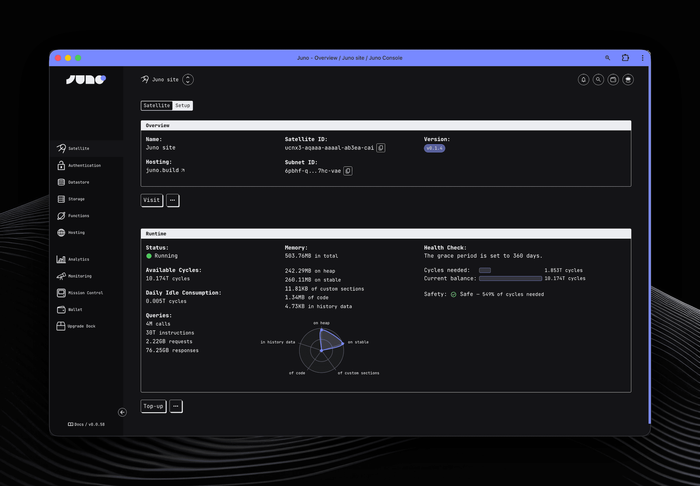

<div align="center" style="display:flex;flex-direction:column;">
  <a href="https://juno.build/">
    
  </a>
</div>

<br />

<p align="center">
  <a href="https://github.com/junobuild/juno"></a>
  <a href="https://github.com/junobuild/juno"></a>
  <a href="https://discord.gg/wHZ57Z2RAG"></a>
</p>

## ⭐️ Description

[Juno] is an open-source serverless platform for hosting static websites, building web applications, and running serverless functions with the privacy and control of self-hosting.

It provides a familiar cloud experience with strong security and zero operational complexity. Each project runs in its own WASM container, fully owned and controlled by you.

Think of it as **Vercel + Firebase + Self-Hosting** - without the compromises.

- 🔑 Authentication [[Docs](https://juno.build/docs/build/authentication)]
- 📦 Datastore [[Docs](https://juno.build/docs/build/datastore)]
- 📂 File Storage [[Docs](https://juno.build/docs/build/storage)]
- 🌐 Hosting [[Docs](https://juno.build/docs/build/hosting)]
- ⚙️ Serverless Functions (Rust & TypeScript) [[Docs](https://juno.build/docs/build/functions)]
- 📊 Analytics [[Docs](https://juno.build/docs/build/analytics)]
- 👀 Monitoring [[Docs](https://juno.build/docs/management/monitoring)]
- 💾 Snapshots [[Docs](https://juno.build/docs/management/snapshots)]

<br />



<br />

## ⚡️ Why Juno?

- **Zero DevOps** - No servers to manage, no infrastructure to maintain
- **True Ownership** - Your code, data, and infrastructure are fully yours
- **Local-First Development** - Full production-like emulator for rapid iteration

## 🚀 Quick Start

```typescript
// Initialize Juno
import { initSatellite } from '@junobuild/core';
await initSatellite();

// Store data
import { setDoc } from '@junobuild/core';
await setDoc({
	collection: 'posts',
	doc: {
		key: 'my-post',
		data: { title: 'Hello Juno!' }
	}
});
```

## 🚢 Deploy

Deploy to production with a single command:

```bash
# Deploy your frontend
juno hosting deploy

# Deploy your serverless functions
juno functions publish
```

Or integrate with GitHub Actions → [Setup CI/CD](https://juno.build/docs/guides/github-actions)

## 💁‍♂️️ Links & Resources

Here are some useful links:

- Looking to get started? Check out the [Guides & Examples](https://juno.build/docs/category/guides-and-examples) for step-by-step tutorials and sample code.
- Explore the full [documentation](https://juno.build) for in-depth details on using and configuring Juno.
- See the [HACKING](HACKING.md) document for instructions on running and developing Juno locally.

## 🖥️ Bootstrap

Planning to build a website, blog, or web application? Start quickly by scaffolding a new project using a template.

```bash
# with npm
npm create juno@latest
# with pnpm
pnpm create juno
# with yarn
yarn create juno
```

## 🎯 Live Examples

Check out the [showcase](https://juno.build/showcase).

## 🧑‍🤝‍🧑 Community

Have questions, comments, or feedback? Join our [Discord](https://discord.gg/wHZ57Z2RAG) or [OpenChat](https://oc.app/community/vxgpi-nqaaa-aaaar-ar4lq-cai/?ref=xanzv-uaaaa-aaaaf-aneba-cai).

## 💬 Contact

Find us on X/Twitter at [@junobuild](https://twitter.com/junobuild) or email us at [hi@juno.build](mailto://hi@juno.build).

[juno]: https://juno.build
